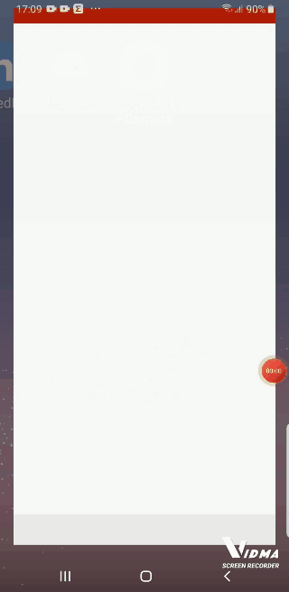

## Projeto desenvolvido para o agendamento de horários nas duas unidades da FCamara.


<p align="center">  <a href="#objetivo">Objetivo</a> •  <a href="#roadmap">Roadmap</a> •   <a href="#tecnologias">Tecnologias</a> •   <a href="#contribuicao">Contribuição</a> •   <a href="#licenc-a">Licença</a> •   <a href="#autor">Autor</a> </p>


<h4 align="center"> Projeto finalizado! </h4>


### Features

- [x] Cadastro de usuário

- [x] -Agendamentos de estações de trabalho 

- [x] -Agendamentos de sala de reuniões

- [x] -Edição e exclusão dos agendamentos

  

###App Mobile


```default

```


